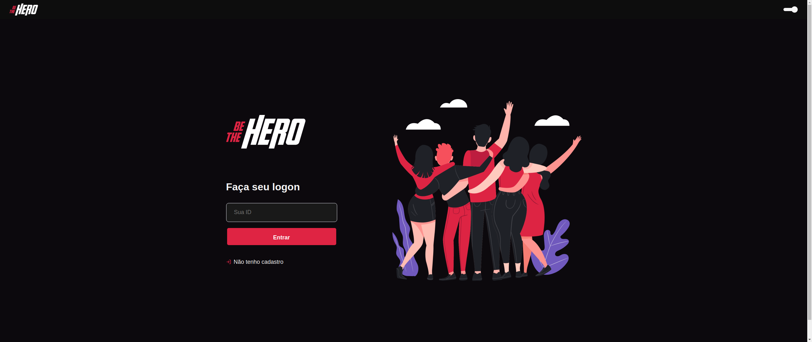
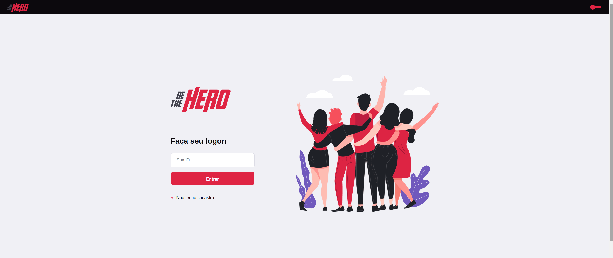
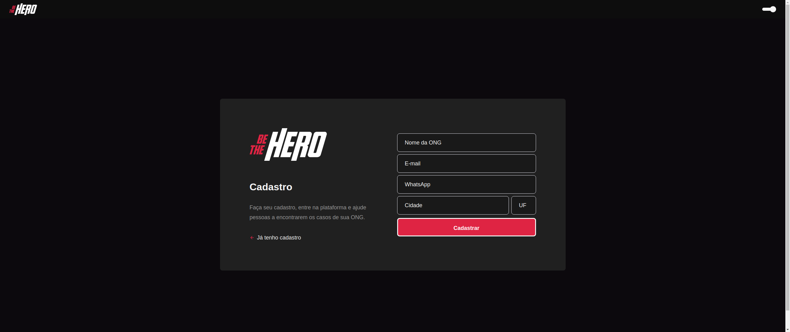
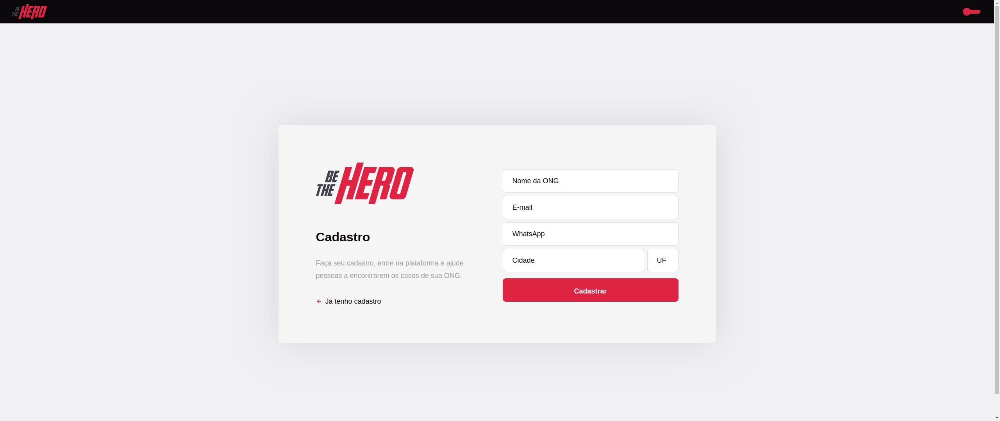
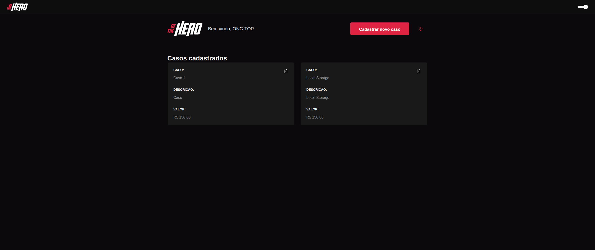
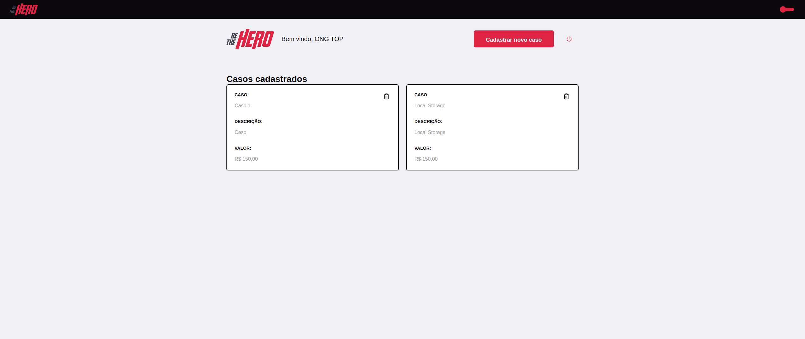
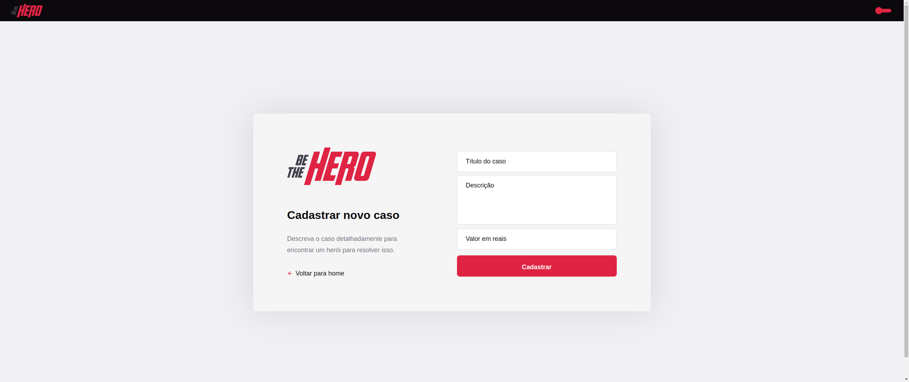
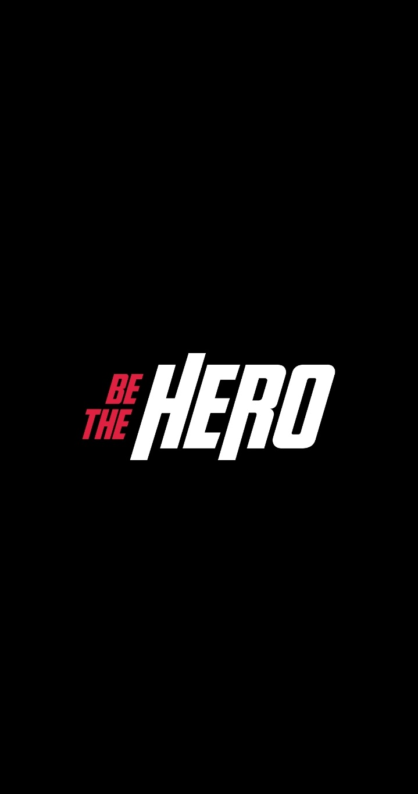
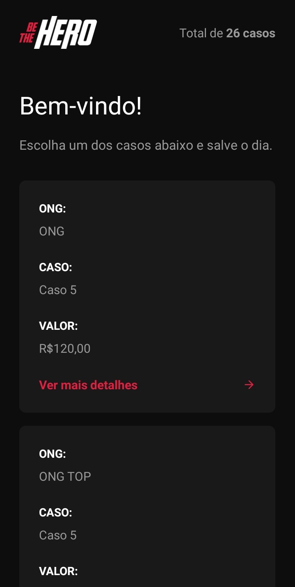
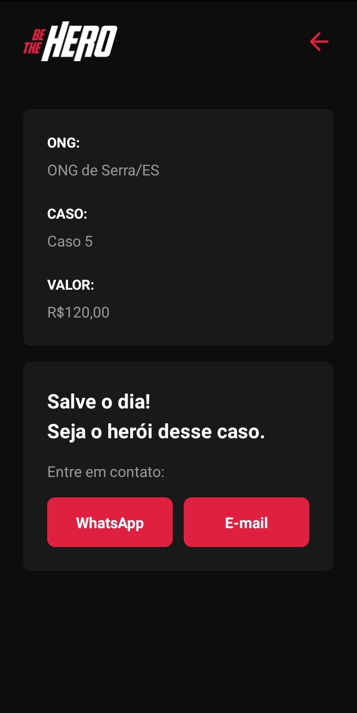

<h1 align="center">
    
</h1>

# Be The Hero
Aplicação com intuito de conectar pessoas interessadas em ajudar ONGS. Desenvolvida com Node.js, ReactJS e React Native.

💻Adicionei um Theme Switcher Light e Dark

💻Utilizei Styled-components para estilizar a aplicação

💻Eslint e Prettier para padronizar o código 

💻Animações nos botões e nos inputs

💻Alterei a animação da navegação do mobile para deixá-la igual a de IOS

💻Quando a ONG não tem nenhum caso registrado, aparece uma mensagem informando que não há casos registrados.

## :camera: Veja:

### Front-end

### Mobile

## :rocket: Tecnologias

<table>
  <thead>
    <th>Back-end</th>
    <th>Front-end</th>
    <th>Mobile</th>
  </thead>
  <tbody>
    <tr>
      <td>Node.js</td>
      <td>ReactJS</td>
      <td>React Native - Expo</td>
    </tr>
    <tr>
      <td>ExpressJs</td>
      <td>Styled-Components</td>
      <td>Styled-Components</td>
    </tr>
    <tr>
      <td>SqLite</td>
      <td>Axios</td>
      <td>Axios</td>
    </tr>
    <tr>
      <td>Nodemon</td>
      <td>React Hooks</td>
      <td>React Hooks</td>
    </tr>
    <tr>
      <td>Cors</td>
      <td>Eslint</td>
      <td>Eslint</td>
    </tr>
    <tr>
      <td>Knex</td>
      <td>Prettier</td>
      <td>Prettier</td>
    </tr>
    <tr>
      <td>Jest</td>
      <td>Jest</td>
      <td>Jest</td>
    </tr>
  </tbody>
</table>
